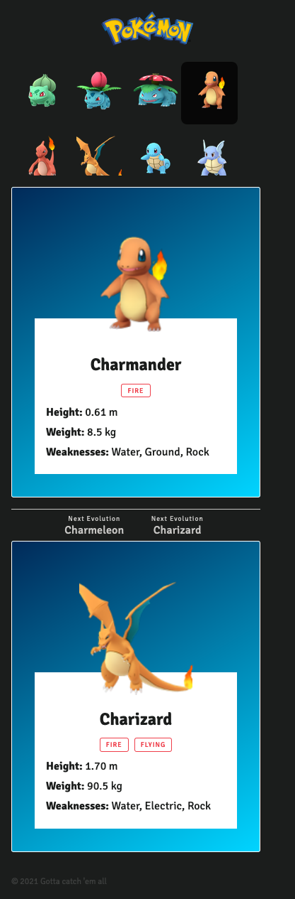
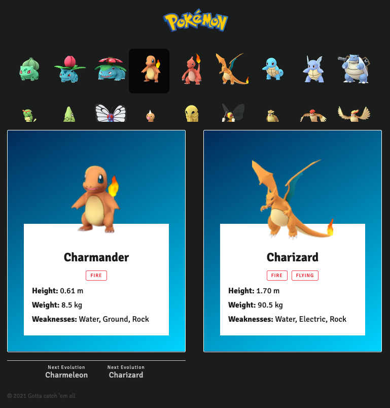
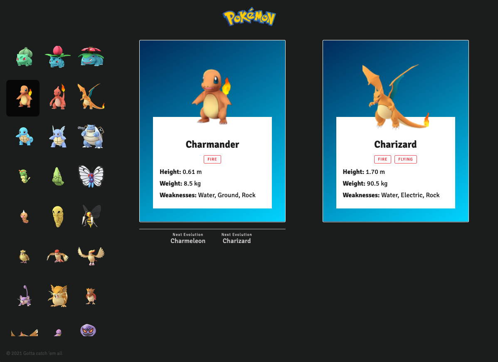

# Runroom Fullstack Test

Está es una prueba para validar los conocimientos de las personas candidatas al puesto de fullstack developer en Runroom.

**Spoiler Alert!**... va de Pokemons

## Stack Tecnológico

* React
* NextJS
* Apollo
* GraphQL
* Typescript
* Styled Components

## Descripción

El proyecto se deberá desarrollar como una SPA en Typescript en la que se deberá desarrollar lo siguiente:

* Cabecera con el logo de Pokemon
* Un listado
* Una card del Pokemon seleccionado
* Una card de su evolución (si la tiene)
* Footer con el copyright

Los datos de todos los Pokemons están dentro del siguiente archivo, y se deberán consumir utilizando GraphQL:

```
.
└── services
    └── db.json
```

El API ya está implementado utilizando el [API de Nextjs](https://nextjs.org/docs/api-routes/introduction), falta crear las queries necesarias para traer todos los Pokemons y el Pokemon seleccionado, dentro de la siguiente carpeta encontrarás los schemas de GraphQL, los resolvers, que son los que se comunican con el API, y las rutas del API:

```
.
└── pages
    └── api
        ├── pokemons
        ├── resolvers
        └── schemas
```

La página se deberá realizar en el siguiente archivo, la inicialización de estilos y tipografías ya están configuradas:

```
.
└── pages
    └── index.tsx
```

Estos son los diseños que esperamos encontrar.

| Móvil | Tablet | Desktop |
|---|---|---|
|  |  |  |

Los settings y gráficos necesarios de la UI la podéis encontrar en:

```
.
└── ui
    ├── svg
    │   └── *
    └── settings.ts
```

El funcionamiento deberá ser el siguiente:


## ¿Cómo empezar?

1. Hacer un repositorio nuevo utilizando este como base (sin hacer un fork).
2. Hacer al menos un primer commit con el código original, para ver la hora de inicio.
3. Hacer commits individuales por cada bloque que vayas haciendo. El último commit marca el final.
4. Envíanos el link a tu repositorio

## ¿Qué valoraremos?

* Simplicidad de la solución
* Organización y calidad de código
* Utilización de componentes modulares
* Mobile first & RWD
* Uso de Git
* Web Performance Optimization
* Conocimiento técnico
* Conocimientos de maquetación (HTML5 y CSS3)
